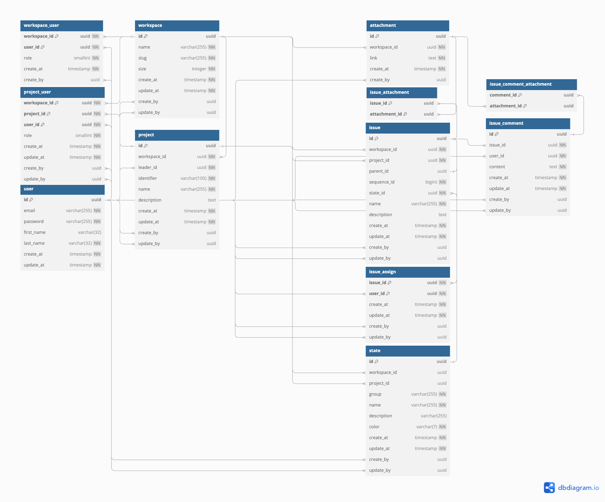

# Mate

Jira와 같이 사용할 수 있는 간단한 이슈 트래커입니다.
개인, 팀 단위의 조직을 지원합니다.

## 사용한 기술
- Spring Boot 3.3.4
- Spring Security
- Spring Data JPA
- Swagger
- MySQL
- JDK 17
- Hexagonal Architecture

## ERD


## 개발 방법
1. `git clone ...`
2. `src/main/resources/application.yaml.tmpl`를 `src/main/resources/application.yaml`로 복사하고 내용을 채워줍니다.
3. `docker/` 폴더로 들어간 후 `docker compose up -d`로 MySQL을 실행합니다.
4. `./gradlew bootRun`으로 실행합니다.

### JWT 키 생성 방법
```shell
 openssl genpkey -algorithm RSA -out private_key.pem -pkeyopt rsa_keygen_bits:2048 
 openssl rsa -in private_key.pem -pubout -out public_key.pem 
```
파일명은 상관없습니다. 해당 명령어로 생성된 키를 `\n' 문자를 제거하고 한 줄로 만들어서 `application.yaml`에 붙여넣습니다.
자세한 예시는 [application.yaml.tmpl](src/main/resources/application.yaml.tmpl)을 참고하세요.